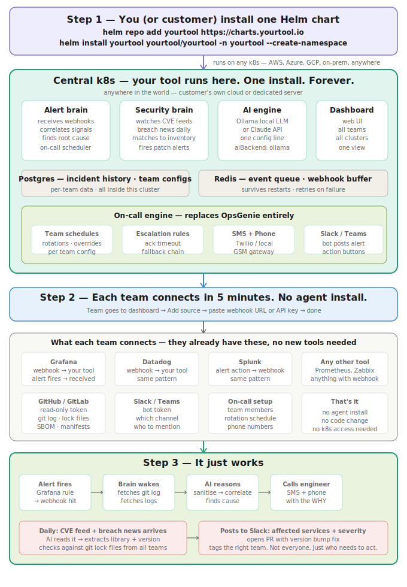

# Grafana Alert Rules — Setup Guide for Wachd

For Wachd to collect GitHub commits and logs for a service when an alert fires, the alert rule **must include a `service` label** that matches the service name in your repository and log system.

Without this label, Wachd still runs AI analysis but skips targeted context collection (no commits, no logs).

---

## The One Requirement: Add a `service` Label

Every alert rule that you want Wachd to enrich with context needs this label set to the name of the affected service:

```
service = <your-service-name>
```

This value must match:
- The GitHub repository name (or the subfolder if it is a monorepo)
- The service name used in your Loki log labels
- The service name used in your Prometheus metric labels

---

## Grafana Unified Alerting (Grafana 9+)

### In the Grafana UI

1. Open **Alerting → Alert rules → New alert rule**
2. Configure your query (PromQL, Loki LogQL, etc.)
3. Scroll to **Labels** section
4. Add: `service` = `your-service-name`



### Via API or Terraform

```json
{
  "for": "5m",
  "labels": {
    "service": "checkout-api"
  },
  "grafana_alert": {
    "title": "checkout-api high error rate",
    ...
  }
}
```

Terraform (grafana provider):
```hcl
resource "grafana_rule_group" "checkout" {
  rule {
    name = "checkout-api high error rate"
    for  = "5m"

    labels = {
      service = "checkout-api"
    }

    ...
  }
}
```

---

## Prometheus Alertmanager

If you are routing Alertmanager webhooks to Wachd, add the label in the alert rule:

```yaml
# prometheus/rules/checkout.yaml
groups:
  - name: checkout
    rules:
      - alert: HighErrorRate
        expr: rate(http_requests_total{status=~"5.."}[5m]) > 0.05
        for: 5m
        labels:
          severity: high
          service: checkout-api        # ← required for Wachd context collection
        annotations:
          summary: "High error rate on checkout-api"
```

---

## Grafana Legacy Alerting (Grafana 8 and below)

Add the service tag in the alert rule's **Tags** field:

```
service = checkout-api
```

Or via the API:
```json
{
  "tags": {
    "service": "checkout-api"
  }
}
```

---

## Kubernetes Deployments — No Label Needed

If your alert uses **kube-state-metrics** labels, Wachd automatically extracts the service name from:

| Label | Example |
|---|---|
| `deployment` | `demo-backend` |
| `pod` (hash suffix stripped) | `demo-backend-5cc9f44fd6-xxxx` → `demo-backend` |

So for Kubernetes-based alerts like this, no extra `service` label is required:

```promql
kube_pod_container_status_waiting_reason{
  reason="crashloopbackoff",
  namespace="production"
} > 0
```

Wachd reads `deployment` or `pod` from `commonLabels` or `alerts[0].labels` and uses that as the service name.

---

## Alert Title Fallback

If no label or Kubernetes label is present, Wachd tries to parse the service name from the alert title using a dash or em-dash separator:

| Title | Extracted service |
|---|---|
| `High error rate — checkout-api` | `checkout-api` |
| `High CPU - payment-service` | `payment-service` |

This is the least reliable method. Use explicit labels where possible.

---

## Full Priority Order

Wachd checks these sources in order and uses the first non-empty value:

1. `tags.service` (Grafana legacy)
2. `commonLabels.service` (Grafana unified / Alertmanager)
3. `alerts[0].labels.service` (Grafana unified per-alert)
4. `labels.service` (Prometheus Alertmanager)
5. `commonLabels.deployment` or `labels.deployment` (Kubernetes)
6. `alerts[0].labels.deployment` (Kubernetes)
7. `pod` label with ReplicaSet/pod hash stripped
8. `tags.app`, `tags.job`, `tags.container` (Grafana legacy fallbacks)
9. Alert title split on ` — ` or ` - `

---

## Testing Your Setup

Send a test webhook to verify Wachd correctly identifies the service:

```bash
curl -X POST https://<your-wachd-host>/api/v1/webhook/<teamId>/<secret> \
  -H "Content-Type: application/json" \
  -d '{
    "title": "High error rate",
    "state": "alerting",
    "commonLabels": {
      "service": "checkout-api",
      "severity": "high"
    },
    "alerts": [
      {
        "status": "firing",
        "labels": {
          "service": "checkout-api",
          "alertname": "HighErrorRate"
        }
      }
    ]
  }'
```

In the worker logs you should see:

```
  Service: checkout-api
  ✓ 3 commits from your-org/checkout-api
```

If you see:
```
  ⚠ Cannot determine service name from alert — skipping targeted collection
```
then the `service` label is missing or does not match any of the sources above.

---

## Connecting Wachd to Grafana

1. In Grafana: **Alerting → Contact points → New contact point**
   - Type: `Webhook`
   - URL: `https://<your-wachd-host>/api/v1/webhook/<teamId>/<secret>`
   - Method: `POST`

2. In **Alerting → Notification policies**, route your alerts to this contact point.

3. In your team's Wachd settings, configure the GitHub token and repository list so context collection works when the alert fires.
